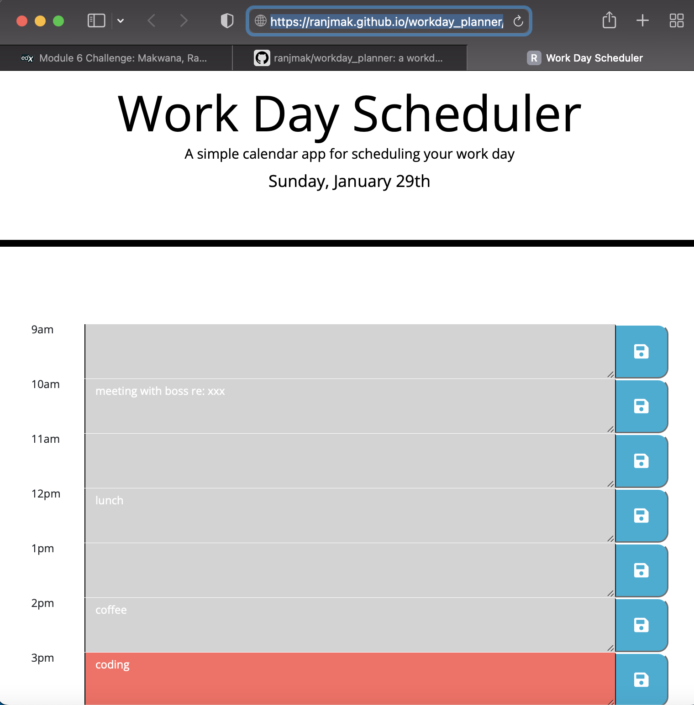

# workday_planner

# using Third-Party APIs (bootstrap, jquery, moment, fontawesome) for a Work Day Scheduler

## the Task

Create a simple calendar application that allows a user to save events for each hour of the day by modifying starter code. This app runs in the browser and features dynamically updated HTML and CSS powered by jQuery.

## User Story

```md
AS AN employee with a busy schedule
I WANT to add important events to a daily planner
SO THAT I can manage my time effectively
```

## Acceptance Criteria

The app:

* Displays the current day at the top of the calender when a user opens the planner.
 
* Presents timeblocks for standard business hours when the user scrolls down.
 
* Color-codes each timeblock based on past(grey), present(red), and future(green) when the timeblock is viewed.
 
* Allows a user to enter an event when they click a timeblock

* Save the event in local storage when the save button is clicked in that timeblock.

* Persist events between refreshes of a page

## notes

bootstrap container class and rows are used in index.html. the rest of the html is generated dynamically using jquery. An event listener is added to the save buttons and when clicked, the schedule event data is inserted into the scheduled events array and to local storage for persistence. Note that a separate clear function is not required, so to clear a scheduled event, the user has to save an empty scheduled event!

## website
https://ranjmak.github.io/workday_planner/

## Github
https://github.com/ranjmak/workday_planner

## screenshots

The following screenshot shows the rendered app:




## Grading Requirements

This homework is graded based on the following criteria: 

### Technical Acceptance Criteria: 40%

* Satisfies all of the above acceptance criteria plus the following:

  * Uses a date utility library to work with date and time

### Deployment: 32%

* Application deployed at live URL

* Application loads with no errors

* Application GitHub URL submitted

* GitHub repo contains application code

### Application Quality: 15%

* Application user experience is intuitive and easy to navigate

* Application user interface style is clean and polished

* Application resembles the mock-up functionality provided in the homework instructions

### Repository Quality: 13%

* Repository has a unique name

* Repository follows best practices for file structure and naming conventions

* Repository follows best practices for class/id naming conventions, indentation, quality comments, etc.

* Repository contains multiple descriptive commit messages

* Repository contains quality README file with description, screenshot, and link to deployed application

## Review

You are required to submit the following for review:

* The URL of the deployed application

* The URL of the GitHub repository, with a unique name and a README describing the project

---
© 2022 edX Boot Camps LLC. Confidential and Proprietary. All Rights Reserved.
